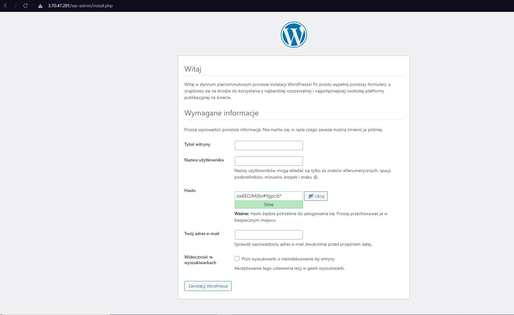

# **Automatyczna Instalacja Wordpress**
## **1.** Instalacja ansible
    yum install ansible 
## **2.** Tworzenie plików konfiguracyjnych potrzebnych do ansible w dowolnym folderze
* ### host.ini
* ### setup.yaml
* ###  vars
    * #### db_cred.yaml
* ###  tasks
    * #### db.yaml
    * #### packages.yaml
    * #### WordPress.yaml
* ### files
    * ### Mariadb.repo
    * ### blog-vhost.conf
    * ### wp-config.php
## **3.** Specyfikacja hosta
### W pliku host.ini w kwadratowych nawiasach piszemy nazwę hosta na którym chcemy wykonywać komendy, następnie IP hosta i imię użytkownika
    [WordPress_nodes]
    3.70.47.201 ansible_user=ec2-user
## **4.** Uzupełnianie pliku setup.yaml z którego ansible wykonuje zadania
### W pierwszej kolejności wskazujemy na imię hosta następnie komendy do wykonania, w tym wypadku komendy zostały podzielone za pomocą inculde_task na trzy pliki dla wyższej przejrzystości i organizacji. Oddzieliliśmy również zmienne uwierzytelniania do bazy danych w innym pliku.
    ---
    - hosts: WordPress_nodes
    become: yes
    vars_files:
        - vars/db_cred.yaml
    tasks:
        - include_tasks: tasks/db.yaml
        - include_tasks: tasks/packages.yaml
        - include_tasks: tasks/WordPress.yaml
## **5.** Instalacja poszczególnych zależności
### Oprócz instalacji samego Wordpresa, potrzebujemy wyspecyfikować kilka innych zależności między innymi, bazę danych, php i serwer http. Po instalacji bazy danych potrzebujemy również stworzyć użytkownika i zadać odpowiednie uprawnienia.
    ...
    - name: "create wp's db"
      mysql_db:
        name: "{{DB_NAME}}"
        state: present
    - name: "create user && asign privileges"
      mysql_user:
        name: "{{DB_USER}}"
        password: "{{DB_PW}}"
        priv: "{{DB_NAME}}.*:ALL"
        state: present
### Zmienne Imię bazy danych, Użytkownik i Hasło zostały przypisane w wzceśniej wspomnianym pliku:
    /vars/cred.yaml
## **6.** Folder "files"
### W tym foldzerze potrzebujemy wskazać niektóre niezbędne ustawienia dla naszej konfiguracji
* ### W pliku blog-vhost.conf ustawiamy na jakim porcie będzie serwowana nasza przyszła aplikacja, scieżka i imię pliku strony indexowej
        <VirtualHost *:80>
            DocumentRoot "/var/www/wordpress"
            DirectoryIndex index.php
        </VirtualHost>
* ### W pliku Mariadb.repo wskazujemy na repozytorium bazy danych
        [mariadb]
        name = MariaDB
        baseurl = https://ftp.bme.hu/pub/mirrors/mariadb/yum/10.6/centos7-amd64
        gpgkey=https://ftp.bme.hu/pub/mirrors/mariadb/yum/RPM-GPG-KEY-MariaDB
        gpgcheck=1
* ###  W pliku wp-config.php ustawiamy między innymi, imiona zmiennych bazodanowych, ścieżkę pliku konfiguracyjnego, itd.
        ...
        define( 'DB_NAME', '{{DB_NAME}}' );
        define( 'DB_USER', '{{DB_USER}}' );
        define( 'DB_PASSWORD', '{{DB_PW}}' );
        define( 'DB_HOST', 'localhost' );
        define( 'DB_CHARSET', 'utf8mb4' );
        define( 'DB_COLLATE', '' );
        ...
        require_once ABSPATH . 'wp-settings.php';
        ...
## **7.** Instalacja wszystkich zależności i strona początkowa Wordpresa
### Po poprawnym ustawieniu wszystich parametrów możemy użyć komendy:
        ansible-playbook -i hosts.ini setup.yaml
### Jak nie pojawiły się błędy to wpisując adres IP maszyny na której instalowaliśmy zależności ma dowolnej przeglądarce powinno się nam wyświetilć:

